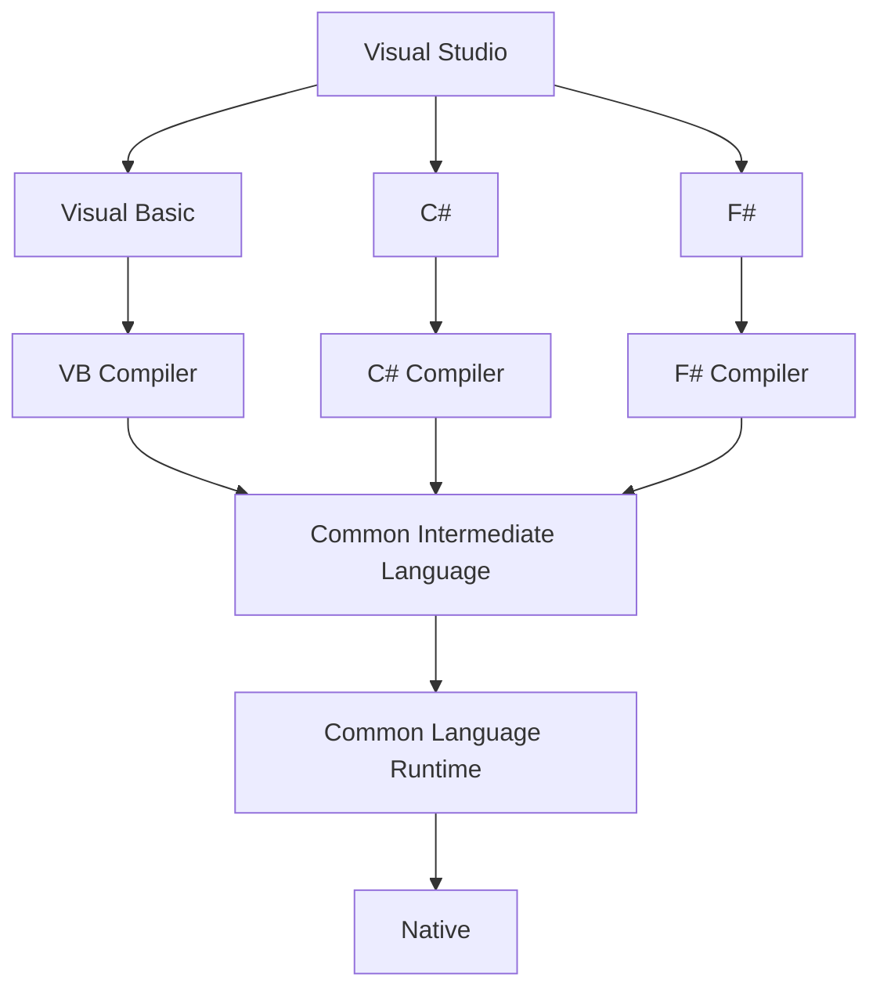

# Vad är .net

.net, egentligen .net framework (kallad dot net) är ett ramverk skapad för att lättare kunna skapa applikationer i windows. Med tiden insåg man att man kunde skapa till andra operativsystem med och .net utvecklades vidare till att fungera med Linux, android, iOS mm.

I första versionen fokuserade man sig mest på den “visuella” delen som blivit så framgångsrik med Visual Basic. Man snyggade upp det och fick det att fungera på VB, C# och ASP.net.

Visual Basic och C# använde WinForms, medan ASP.net använde WebForms.

När vi kompilerar koden går den igenom en del steg. Först kör kompilatorn igenom koden omvandlar det till Common Intermediate Language. CIL är ett språk, precis som C# men som är skriven på ett sätt som är skriven för att runtimefilerna ska förstå det. Det är ett eget språk som .net har helt enkelt. Då alla språk omvandlas till CIL kan man också omvandla tillbaka från CIL till vilket språk som helst. Alltså kan man omvandla från C# till VB och vice versa. När koden är omvandlad kan man nu skicka den vidare till Common Language Runtime. CLR kan nu mappa koden till att fungera med det operativsystem som finns. Om vi exempelvis öppnat en fil från C# kommer den att anpassa funktionen till Linux, BSD (Mac) eller Windows.

Mer information om .net finns här: [Vad är .NET? | Microsoft Docs](https://docs.microsoft.com/sv-SE/shows/net-core-101/what-is-net)