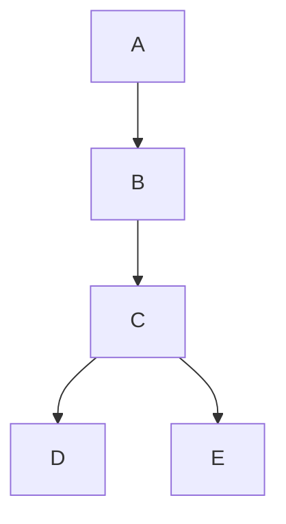

# Vad är .net

.net, egentligen .net framework (kallad dot net) är ett ramverk skapad för att lättare kunna skapa applikationer i windows. Med tiden insåg man att man kunde skapa till andra operativsystem med och .net utvecklades vidare till att fungera med Linux, android, iOS mm.

I första versionen fokuserade man sig mest på den “visuella” delen som blivit så framgångsrik med Visual Basic. Man snyggade upp det och fick det att fungera på VB, C# och ASP.net.

